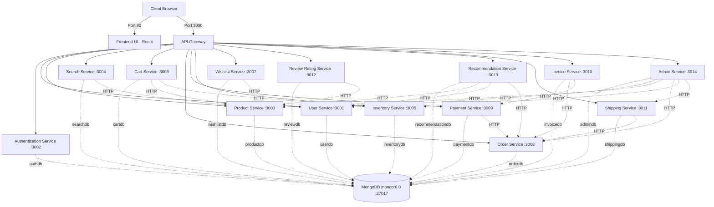

# Clahan Store Architecture & Implementation Plan

## 1. Architecture Overview
Clahan Store is a premium e-commerce platform built on a robust, cloud-native **Microservices Architecture**. It is designed to be highly scalable and maintainable, consisting of 15 completely independent backend services, a modern React frontend UI, a centralized API Gateway, and a scalable MongoDB database cluster.

### Key Architectural Principles
- **API Gateway Pattern**: All client requests are routed through a central API Gateway (`api-gateway`) which hands token validation and forwards requests to the appropriate downstream service.
- **Database per Service (Logical)**: To ensure loose coupling, each service manages its own isolated data domain. They share a single MongoDB host (`mongo:6.0`), but each creates and maintains its own logical database (e.g., `userdb`, `productdb`, `orderdb`, etc.).
- **Synchronous Internal Communication**: Services communicate directly with each other over HTTP using internal Docker/Kubernetes network URLs (for example, `review-rating-service` connects to `product-service` to validate reviews).

## 2. Architecture Diagram
-

## 3. Microservices Breakdown

1. **`user-service`**: Manages user profiles, registration, and user data. Provides endpoints for lookup by other services.
2. **`authentication-service`**: Handles JWT generation, token validation, and password verification workflows.
3. **`api-gateway`**: Centralized reverse proxy. Validates authentication tokens before routing traffic to backend microservices.
4. **`product-service`**: Core catalog management (CRUD operations for products, categories, stock initialization).
5. **`search-service`**: Full-text product search engine (fetches data internally from the core product-service).
6. **`inventory-service`**: Real-time stock level management, decrements stock upon order placement.
7. **`cart-service`**: Shopping cart lifecycle management. Integrates with product and inventory services to validate items.
8. **`wishlist-service`**: Manages user favorites and integration with products.
9. **`order-service`**: Order placements, status tracking, and cart processing orchestration.
10. **`payment-service`**: Payment processing and verification (mocked). Reports back payment IDs to `order-service`.
11. **`invoice-service`**: Generates digital receipts for paid orders based on payment and order history data.
12. **`shipping-service`**: Logistics, delivery tracking, and shipping status updates.
13. **`review-rating-service`**: Customer text reviews and star ratings for products. Checks if a user has ordered the product.
14. **`recommendation-service`**: AI-based (mocked) personalized product suggestions based on user shopping/order history.
15. **`admin-service`**: Unified dashboard proxy aggregating site-wide statistics and metrics across users, products, orders, inventory, etc.

## 4. Implementation Plan

### Phase 1: Local Docker Compose Setup
- **Containerization**: Each microservice runs in its own tightly-scoped container running Node.js. The frontend UI runs off an NGINX or Vite standard container on port 80.
- **Bootstrapping**: Utilizing `docker-compose.yml`, all containers are brought up simultaneously. Environment variables map URLs to internal Docker containers (e.g. `PRODUCT_SERVICE_URL=http://product-service:3003`).
- **Database Creation**: MongoDB natively supports logical database creation on-the-fly, fulfilling the "database-per-service" architectural requirement via the Mongo driver.

### Phase 2: Staging Kubernetes Deployment
- **Initial Rollout**: The platform should use the built-in `kubernetes/deployments` directory to map the current architecture to Kubernetes constructs (Deployments, Services, ConfigMaps).
- **Environment Targeting**: Place all pods and internal Services inside the `Clahan Store` namespace to prevent pollution of the default environment context.
- **External Exposure**: Use basic `NodePort` mapping initially to test cluster routing over the `api-gateway` pod logic.

### Phase 3: High Availability & Scalability Enhancements
- **Load Balancing Integration**: Install external load balancer components like HAProxy, utilizing `MetalLB` as an IP address pool allocator.
- **Enhanced Gateway Routing**: Substitute the basic Express.js gateway with Kubernetes-native `kgateway` rules mapped to respective microservice `ClusterIP` instances, maximizing throughput.
- **Orchestrated Autoscaling**: Introduce Kubernetes Horizontal Pod Autoscaler (HPA) metrics server logic to automatically spool up duplicate replicas of high-load services like the Frontend, Product, and Cart services seamlessly behind the load balancers.

[def]: image.png